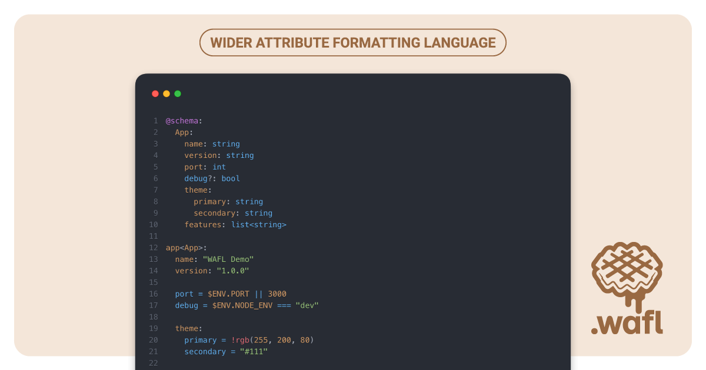

# WAFL    



WAFL (Wider Attribute Formatting Language) is a human-readable configuration language that layers typed schemas, expressions, and reusable tags on top of an indentation-based syntax. This monorepo hosts the core parser/evaluator, the CLI/runtime and tooling packages.

## Highlights

- Human-first syntax with optional `%WAFL` headers, `@import` directives, and type annotations such as `app<App>`.
- Inline expressions powered by `$ENV` variables plus conditional list items (`- if condition: value`) for environment-aware configs.
- Built-in tag registry (`!rgb`, `!file`, …) that can be extended from the core engine.
- Schema-driven validation via `@schema` blocks or shared schema files.
- CLI commands to build or validate `.wafl` files and emit fully resolved JSON.
- Polyglot runtimes.

## Repository layout

| Package             | Path              | Description                                                                                    |
| ------------------- | ----------------- | ---------------------------------------------------------------------------------------------- |
| [`@wafl-lang/core`](https://www.npmjs.com/package/@wafl-lang/core)   | `packages/core`   | Parser, resolver, evaluator, schema validator, and shared utilities.                           |
| [`@wafl-lang/config`](https://www.npmjs.com/package/@wafl-lang/config) | `packages/config` | CLI and programmatic API orchestrating loading, resolving, evaluating, validating configs. |
| [`@wafl-lang/cli`](https://www.npmjs.com/package/@wafl-lang/cli)    | `packages/cli`    | Thin global binary that delegates to the internal CLI inside `@wafl-lang/config`.              |

## Getting started

1. **Requirements** — Node.js 18+, [pnpm](https://pnpm.io/) 8+, and (optionally) PHP 8.2+ for the PHP port.
2. **Install dependencies**
   ```bash
   pnpm install
   ```
3. **Useful scripts (run from repo root)**
   - `pnpm dev` – rebuilds and prints the sample config at `packages/config/examples/app.config.wafl`.
   - `pnpm build` – executes build scripts for each workspace.
   - `pnpm test` – runs the Node.js test suites across workspaces.
   - `pnpm -r test` – runs every package's unit tests (core, config, cli).

### Running the CLI locally

You can run the CLI straight from the workspace or install the `@wafl-lang/cli` package globally:

```bash
# Workspace execution
pnpm --filter @wafl-lang/config exec node bin/wafl.mjs build packages/config/examples/app.config.wafl

# Optional global install (once published)
pnpm install -g @wafl-lang/cli
wafl build path/to/app.config.wafl --env.NODE_ENV=dev
```

The CLI currently supports two commands:

```bash
wafl build <file>      Parse, resolve, evaluate, and print/write the final JSON
wafl validate <file>   Run every step except emitting JSON

Options:
  --out=FILE           Write the resolved config to a JSON file
  --env.KEY=value      Inject environment variables (e.g., --env.PORT=8080)
```

## Language primer

```
@import: schema.wafl

app<App>:
  name: "WAFL Demo"
  version: "1.0.0"
  port = $ENV.PORT || 3000
  debug = $ENV.NODE_ENV === "dev"

  theme:
    primary = !rgb(255, 200, 80)
    secondary = "#111"

  features:
    - login
    - analytics
    - if $ENV.NODE_ENV === "dev": monitoring
```

- **Imports** — Chain multiple files with `@import` (string or array). Imports are merged before the current file is applied.
- **Schemas** — Define reusable shapes in `@schema` blocks or dedicated files. Keys suffixed with `<Type>` (e.g., `app<App>`) map sections to schema entries.
- **Expressions** — `key = expression` entries are evaluated with safe access to `$ENV` and JavaScript expressions (`===`, `&&`, arithmetic, etc.).
- **Conditionals** — Inside lists, prepend `- if <expr>: value` to include entries only when the expression evaluates to truthy.
- **Tags** — Prefix values with `!tag(...)` to invoke helpers. Built-in tags include `!rgb(r, g, b)` and `!file(relative/path)`; add new tags by registering handlers in `packages/core/src/tags.mjs`.
- **Type annotations** — `key<Type>` markers are captured prior to resolution, so validation still works even if keys rename themselves during evaluation.

### Schema example

```
@schema:
  App:
    name: string
    version: string
    port: int
    debug?: bool
    theme:
      primary: string
      secondary: string
    features: list<string>
```

During `wafl build` / `wafl validate` the engine merges the schema, resolves type names, and ensures the resulting document conforms. Any missing required field or type mismatch triggers a descriptive error.

## Learning more

- Browse `packages/config/examples/` for end-to-end `.wafl` samples.
- Dive into `packages/core/src/` to see how parsing (`parser.mjs`), imports (`loader.mjs`), resolving (`resolver.mjs`), evaluating (`eval.mjs`), and validation (`schema.mjs`) compose the pipeline.
